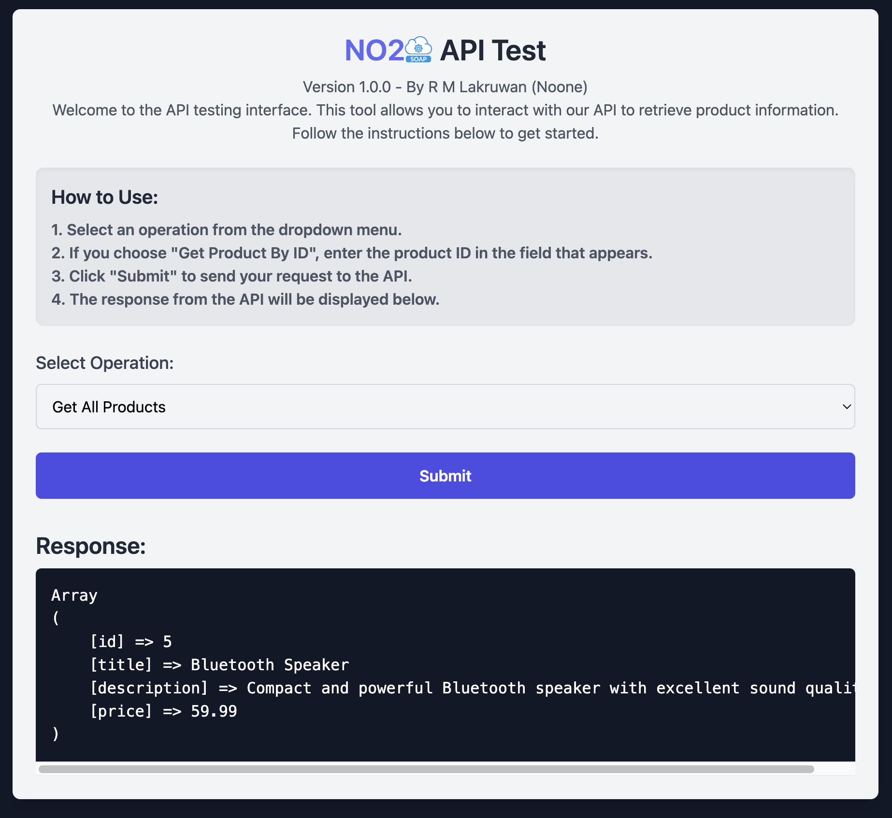

# No2SOAP Project

This project is a SOAP-based API for managing product data.



## Features

- Retrieve all products
- Retrieve a product by ID

## Installation

1. Clone the repository:
   ```bash
   git clone https://github.com/lakathekolla/No2SOAP.git
   ```
2. Navigate to the project directory:
   ```bash
   cd soaptest
   ```
3. Set up your database using the `nosoap.sql` file.

## Usage

1. Start your local server.
2. Edit the configuration files to match your environment
3. **client/client.php**: Ensure the `location` and `uri` parameters point to your SOAP server.
4. **server/config.php**: Update the database connection details to match your database setup.
5. Access the API via `http://localhost/1v0/soaptest/`.

## License

This project is licensed under the MIT License.
